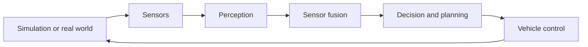

# ADAS Pipeline

## Overview

An ADAS converts information about the environment into safe vehicle actions.

## Stages

1. **Simulation or real world** provides roads, lanes, vehicles, and driving conditions.
2. **Sensors** measure the environment and vehicle state.
3. **Perception** detects lanes, vehicles, obstacles, and traffic infrastructure.
4. **Sensor fusion** combines complementary sensor measurements.
5. **Decision and planning** choose behaviour and a desired path.
6. **Vehicle control** produces steering, throttle, and braking commands.

The pipeline is closed-loop: the vehicle action changes the next sensor observation.

Related: [Closed-Loop System](Closed_Loop_System.md) · Next: [Highway Lane Following Architecture](../02_architecture/Highway_Lane_Following_Test_Bench_Architecture.md)