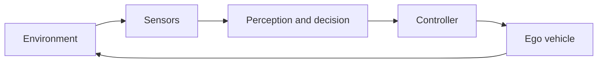

# Closed-Loop ADAS System

A closed-loop system continuously measures the result of its previous action and corrects future actions.

For lane following, the camera observes lane markers, the decision logic selects a target lane position, and the controller steers the ego vehicle. The changed vehicle position appears in the next camera observation.

A closed loop is essential because roads, traffic, and sensor measurements change over time.