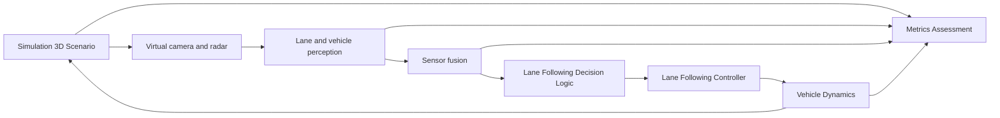
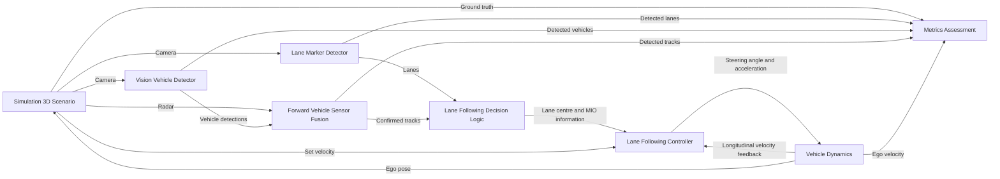

# Highway Lane Following Test Bench Architecture

## Objective

This document explains the end-to-end architecture of the MathWorks Highway Lane Following test bench. The system uses a virtual highway environment, virtual sensors, perception algorithms, decision logic, a controller, vehicle dynamics, and metrics to simulate and assess lane-following behaviour.

The goal is to keep the ego vehicle centred in its lane while maintaining a driver-set speed and a safe gap to a relevant lead vehicle.

## Why Is It Needed?

An ADAS function cannot be validated by looking at one algorithm in isolation. It must be evaluated as a closed system:

- The road and traffic create the driving situation.
- Sensors observe that situation.
- Perception interprets sensor measurements.
- Decision logic selects relevant information.
- The controller commands the ego vehicle.
- Vehicle dynamics produces the actual motion.
- Metrics compare the result with known simulation truth.

The test bench makes these interactions repeatable, observable, and safe to evaluate.

## Position in the ADAS Pipeline



## System Objective

The architecture performs two coordinated functions:

| Function | Goal | Main output |
| --- | --- | --- |
| Lateral lane following | Keep the ego vehicle near the lane centre | Steering angle |
| Longitudinal following | Maintain set speed or a safe gap to a lead vehicle | Acceleration or braking command |

## Major Subsystems

| Subsystem | Responsibility | Main outputs |
| --- | --- | --- |
| Simulation 3D Scenario | Creates the virtual road, actors, ego vehicle, sensors, and ground truth | Camera, radar, lane truth, actor truth |
| Lane Marker Detector | Detects lane boundaries from camera imagery | Lane detections |
| Vision Vehicle Detector | Detects vehicles from camera imagery | Vehicle detections |
| Forward Vehicle Sensor Fusion | Combines vision and radar observations into reliable object tracks | Confirmed tracks |
| Lane Following Decision Logic | Estimates ego-lane centre and selects the most important object | Lane centre, MIO information |
| Lane Following Controller | Converts references and feedback into vehicle commands | Steering angle, acceleration |
| Vehicle Dynamics | Calculates the physical response of the ego vehicle | Pose and velocities |
| Metrics Assessment | Evaluates behaviour and perception against ground truth | Performance measures and displays |

## Architecture Overview



## 1. Simulation 3D Scenario

### Responsibility

The Simulation 3D Scenario is the virtual world in which the ADAS system operates. It creates the road geometry, lane boundaries, ego vehicle, other actors, and sensor views.

### Key Outputs

| Output | Used by |
| --- | --- |
| Camera stream | Lane Marker Detector and Vision Vehicle Detector |
| Radar stream | Forward Vehicle Sensor Fusion |
| Lane boundaries truth | Metrics Assessment |
| Actors truth | Metrics Assessment |
| Ego-vehicle interface | Closed-loop update from Vehicle Dynamics |

### Engineering Role

Simulation provides controlled and repeatable situations that would be expensive, unsafe, or difficult to reproduce using a physical vehicle. It also provides ground truth for objective evaluation.

## 2. Perception

### Lane Marker Detector

The Lane Marker Detector receives camera frames and outputs lane detections. These detections describe lane boundaries relevant to the ego vehicle.

Its architectural role is to supply the road reference needed for lateral lane following.

### Vision Vehicle Detector

The Vision Vehicle Detector receives camera frames and produces vehicle detections. These are observations, not yet stable object tracks.

### Forward Vehicle Sensor Fusion

Forward Vehicle Sensor Fusion combines camera-based vehicle detections with radar measurements. Its output is a set of confirmed tracks representing surrounding vehicles.

Its architectural role is to provide a more reliable situation picture than either sensor alone.

## 3. Lane Following Decision Logic

The decision-logic block converts perception outputs into a compact controller interface.

### Inputs

| Input | Source |
| --- | --- |
| Lanes | Lane Marker Detector |
| Tracks | Forward Vehicle Sensor Fusion |

### Outputs

| Output | Meaning |
| --- | --- |
| Lane Center | Reference geometry for lane-centred steering |
| MIO Relative Distance | Distance to the most important object (MIO) |
| MIO Relative Velocity | Relative speed between ego vehicle and MIO |
| MIO Track Index | Identifier of the selected track for traceability |

### High-Level Responsibilities

The block makes two decisions:

1. **Lateral decision:** estimate the centre of the ego lane.
2. **Longitudinal decision:** select the relevant lead vehicle in the ego lane.

The MIO is not merely the nearest object. It is typically the closest confirmed vehicle ahead that is relevant to the ego vehicle’s lane and speed control.

## 4. Lane Following Controller

The Lane Following Controller transforms decision-layer information into commands for the ego vehicle.

### Inputs

| Input | Purpose |
| --- | --- |
| Set Velocity | Desired cruise speed from the scenario or driver setting |
| Lane Center | Lateral reference path |
| MIO Relative Distance | Lead-vehicle gap |
| MIO Relative Velocity | Lead-vehicle closing or opening speed |
| Longitudinal Velocity | Current ego-vehicle speed feedback |

### Outputs

| Output | Purpose |
| --- | --- |
| Steering Angle | Controls lateral vehicle motion |
| Acceleration | Controls longitudinal vehicle motion |

### Architectural Role

The controller is the action layer. It uses lane-centre information for steering and MIO information plus speed feedback for acceleration or braking. The internal control design is intentionally outside the scope of this architecture document.

## 5. Vehicle Dynamics

Vehicle Dynamics converts steering-angle and acceleration commands into ego-vehicle motion.

### Inputs

| Input | Unit |
| --- | --- |
| Steering Angle | rad |
| Acceleration | m/s² |

### Outputs

| Output | Architectural use |
| --- | --- |
| Pose | Updates the ego vehicle in the simulation scenario |
| Longitudinal Velocity | Feeds back to the controller and metrics |
| Lateral Velocity | Describes sideways motion of the ego vehicle |

The model closes the physical loop: controller commands cause motion, motion changes sensor observations, and those observations drive the next control cycle.

## 6. Metrics Assessment

Metrics Assessment evaluates the system using both algorithm outputs and simulation ground truth.

### Inputs

| Category | Examples |
| --- | --- |
| Ego-vehicle behaviour | Longitudinal velocity and acceleration behaviour |
| Perception outputs | Detected lanes and detected vehicles |
| Fusion outputs | Detected tracks |
| Ground truth | Lane boundaries, actor states, vehicle bounding boxes |

### Ground Truth Versus Algorithm Output

```text
Ground truth       = what actually exists in the simulated world
Algorithm output   = what the ADAS system estimates from sensor data
```

Comparing them allows the test bench to assess detection, tracking, lane following, speed response, and safe-gap behaviour.

## End-to-End Data Flow

1. The simulation scenario creates a road, traffic, and the ego vehicle.
2. Virtual camera and radar sensors generate measurements.
3. Perception detects lanes and vehicles.
4. Sensor fusion produces confirmed vehicle tracks.
5. Decision logic creates a lane-centre reference and selects the MIO.
6. The controller computes steering and acceleration commands.
7. Vehicle Dynamics updates ego pose and velocity.
8. The updated pose feeds back into the scenario for the next simulation step.
9. Metrics Assessment compares system outputs with ground truth.

## Closed-Loop Architecture

The test bench contains two essential feedback loops:

### Vehicle-Control Loop

```text
Controller ? Vehicle Dynamics ? Ego velocity and pose ? Controller / Simulation
```

This loop ensures that the controller responds to the actual vehicle state rather than assuming its commands were executed perfectly.

### Perception-Environment Loop

```text
Vehicle pose ? Simulation scene ? Sensor data ? Perception ? Controller ? Vehicle pose
```

As the ego vehicle moves, sensor viewpoints and detected road/traffic conditions change. This is why the full system must be evaluated as a closed loop.

## Engineering Notes

- Simulation ground truth is an evaluation reference; realistic ADAS algorithms should operate on sensor-derived information.
- The controller receives only the decision-relevant MIO signals, not every object track.
- `MIO Track Index` is useful for debugging and visualization, but not required by the controller interface.
- The architecture separates responsibilities cleanly, allowing perception, fusion, control, and dynamics to be validated independently and as an integrated system.
- Algorithm mathematics, tuning, and implementation details will be studied in later phases.

## Key Takeaways

- Highway lane following is a system-of-systems problem, not just a steering algorithm.
- Lateral behaviour depends on lane-centre information; longitudinal behaviour depends on set speed, ego speed, and lead-vehicle information.
- The decision layer creates the interface between perception and control.
- Vehicle dynamics closes the loop by turning commands into motion.
- Metrics Assessment uses simulation ground truth to measure the behaviour and quality of the full ADAS pipeline.

## References

- [MathWorks: Highway Lane Following](https://www.mathworks.com/help/driving/ug/highway-lane-following.html)
- [MathWorks: Generate Code for Highway Lane Following Controller](https://www.mathworks.com/help/driving/ug/generate-code-for-highway-lane-following-controller.html)

## Next Topic

The architecture phase is complete. The next phase is a detailed study of the Lane Marker Detector, beginning with its role, interface, and evaluation before examining its core logic.