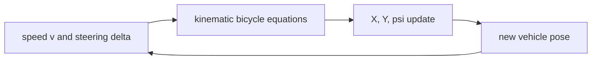
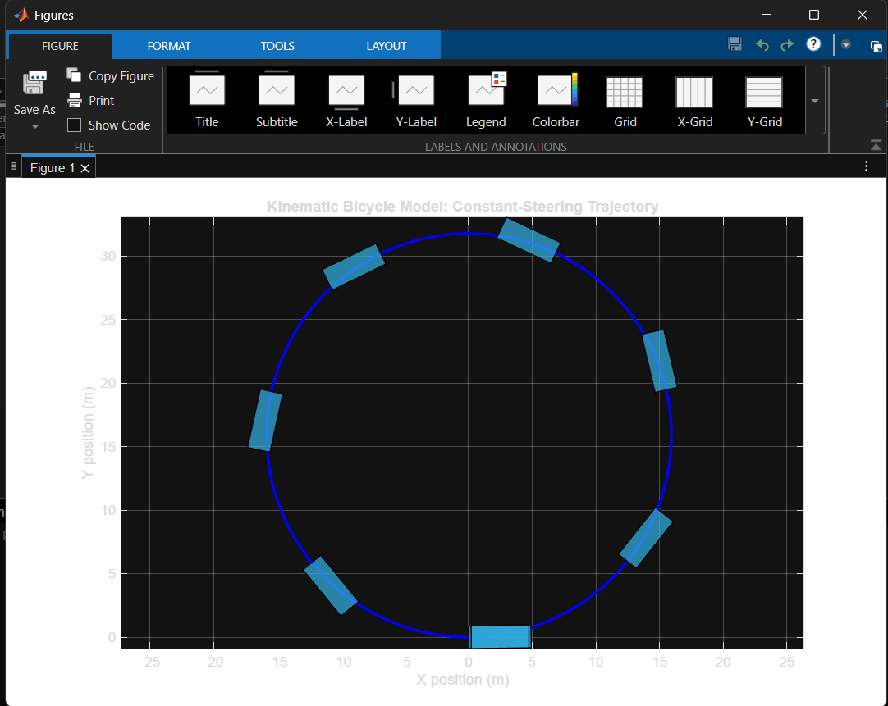
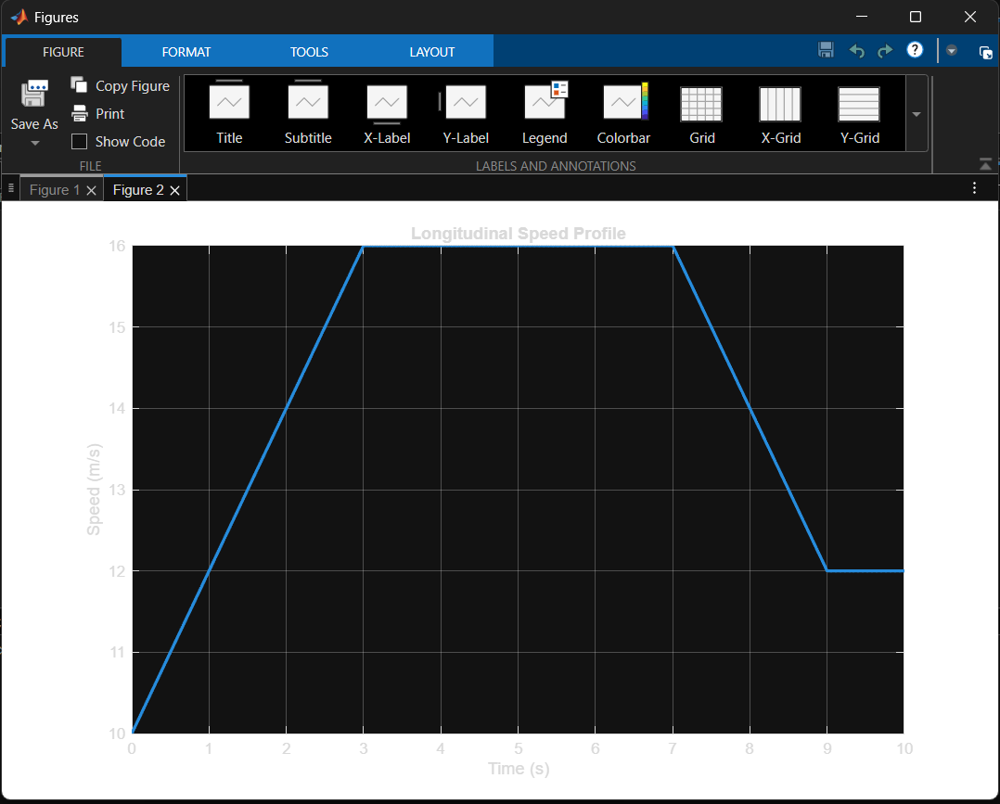
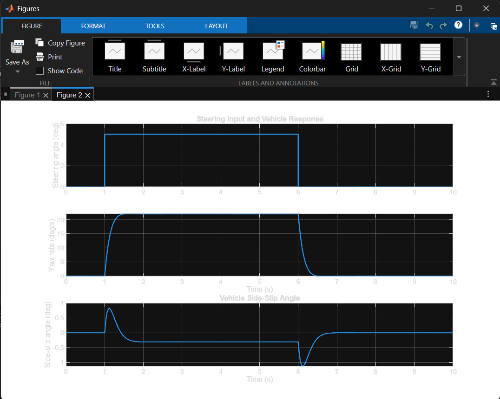
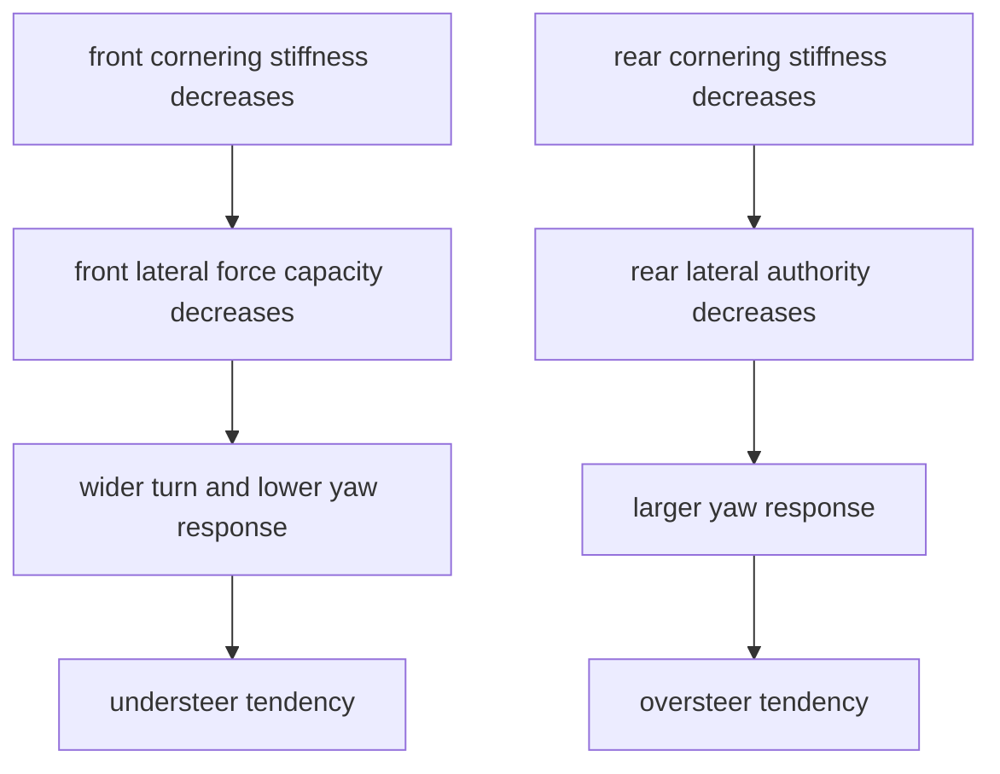
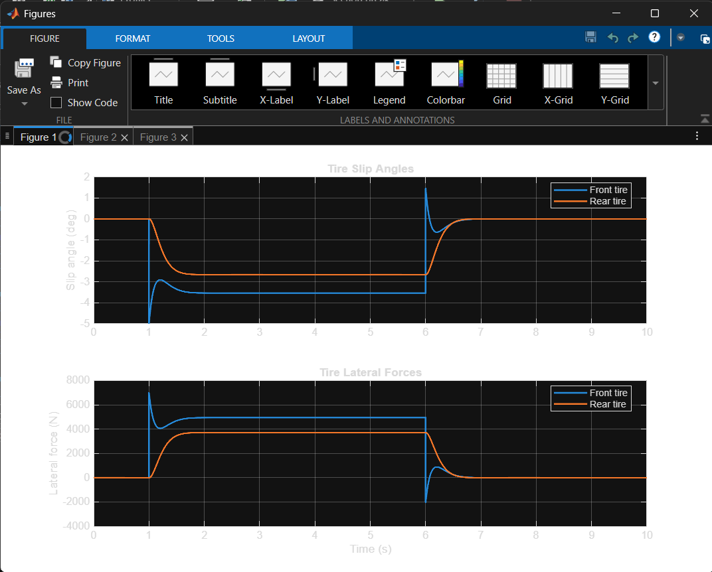
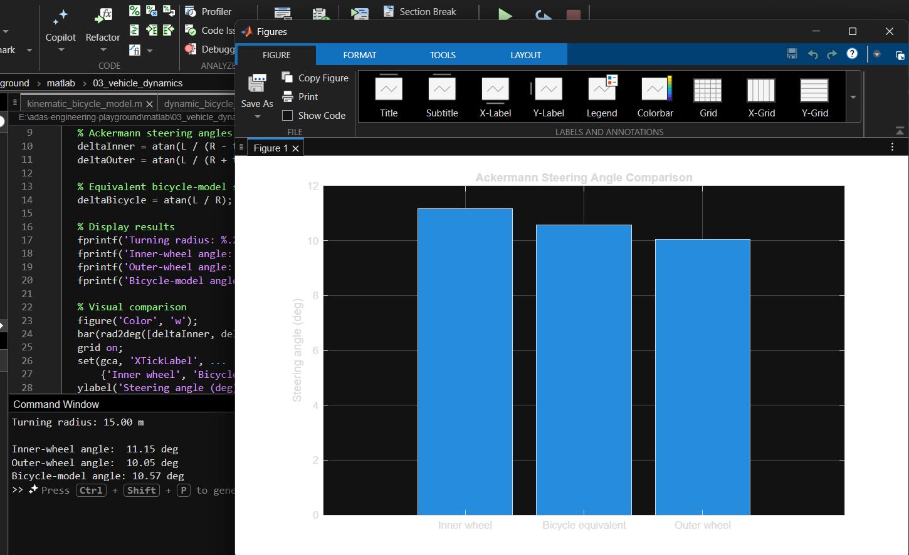
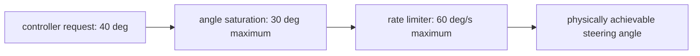
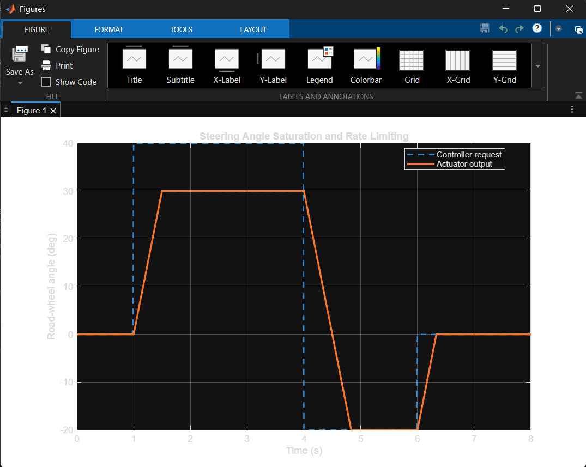
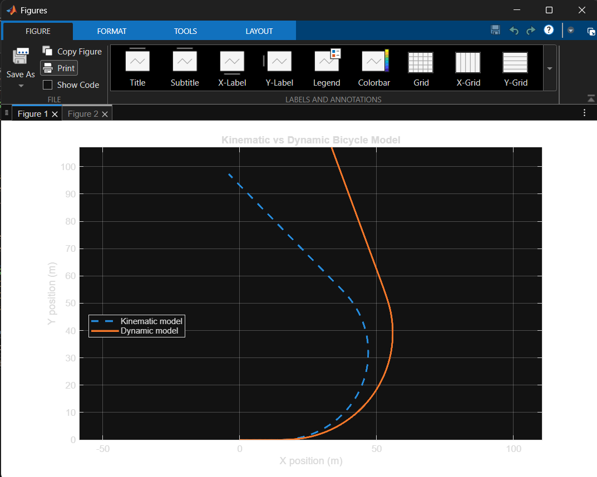

# Vehicle Dynamics: From Steering Commands to Vehicle Motion

## Objective

This chapter explains the vehicle-dynamics concepts used while building the MATLAB exercises in `matlab/03_vehicle_dynamics`. The focus is a passenger car used in ADAS simulation: how steering and acceleration commands become position, heading, yaw rate, and tyre-force responses.

The material progresses from a simple kinematic bicycle model to a dynamic bicycle model, then connects those models to Ackermann steering and realistic actuator limits.

## Why Vehicle Dynamics Matters for ADAS

An ADAS controller does not move a vehicle directly. It sends commands such as steering angle and acceleration; the vehicle model determines the motion that actually occurs.


For a lane-following feature, an inaccurate vehicle model can make a controller look better or worse than it would be in a real car. The model must therefore match the question being studied.

## 1. Coordinate Systems and Basic Quantities

Two coordinate systems are used.

```text
World frame:                 Vehicle body frame:

Y (north)                    y (left)
^                            ^
|                            |
|                            +----> x (forward)
+----> X (east)                   vehicle heading: psi
```

| Symbol | Meaning | Unit |
| --- | --- | --- |
| `X`, `Y` | Vehicle position in the world frame | m |
| `psi` | Vehicle heading (yaw angle) | rad or deg |
| `u` | Longitudinal/forward velocity | m/s |
| `v` | Lateral/sideways velocity | m/s |
| `r` | Yaw rate | rad/s |
| `delta` | Front road-wheel steering angle | rad or deg |
| `L` | Wheelbase | m |

The vehicle heading describes the direction the car body faces. Yaw rate describes how quickly that direction changes.

## 2. The Bicycle-Model Idea

A real car has four tyres. A bicycle model combines the left and right tyres on each axle into one equivalent front tyre and one equivalent rear tyre.

```text
                     front equivalent tyre
                             /
                            /  delta
                           o
                           |
                           | L = wheelbase
                           |
                           o
                     rear equivalent tyre
```

This keeps the important turning behaviour while avoiding unnecessary detail during early controller design.

| Model | Captures | Suitable use |
| --- | --- | --- |
| Kinematic bicycle | Geometric motion from speed and steering | Low-to-moderate-speed path tracking; first controller prototypes |
| Dynamic bicycle | Tyre slip, lateral force, yaw inertia, lateral velocity | Higher-speed handling, controller-response and stability studies |

## 3. Kinematic Bicycle Model

The kinematic model assumes that each tyre rolls without lateral slip. Steering angle therefore determines the vehicle curvature directly.

### States and Inputs

State vector:

$$
\begin{bmatrix}X & Y & \psi\end{bmatrix}^T
$$

Inputs:

$$
v_{\text{speed}}, \quad \delta
$$

### Continuous-Time Equations

$$
\dot{X} = v_{\text{speed}}\cos(\psi)
$$

$$
\dot{Y} = v_{\text{speed}}\sin(\psi)
$$

$$
\dot{\psi} = \frac{v_{\text{speed}}}{L}\tan(\delta)
$$

The third equation is especially important: increasing speed or steering angle increases yaw rate; increasing wheelbase reduces yaw rate for the same steering angle.

### Turning Radius

For constant steering, the vehicle follows a circular path:

$$
R = \frac{L}{\tan(\delta)}
$$

For `L = 2.8 m` and `delta = 10 deg`, the radius is approximately `15.9 m`. Smaller steering angles produce wider turns; larger angles produce tighter turns.

### Discrete-Time Euler Update

MATLAB simulations use a fixed sample time `Ts`. Forward Euler integration gives:

$$
X_{k+1} = X_k + T_s v_k\cos(\psi_k)
$$

$$
Y_{k+1} = Y_k + T_s v_k\sin(\psi_k)
$$

$$
\psi_{k+1} = \psi_k + T_s\frac{v_k}{L}\tan(\delta_k)
$$



### Adding Longitudinal Acceleration

If acceleration is an input, speed changes as:

$$
v_{k+1} = \max\left(0, v_k + T_s a_k\right)
$$

The `max(0, ...)` guard prevents a simple model from creating a negative forward speed during braking. In the completed exercise, acceleration raised speed from `10 m/s` to `16 m/s`; braking later reduced it to `12 m/s`.





### What the Kinematic Model Does Not Include

- Tyre lateral force
- Tyre slip angle
- Vehicle mass and yaw inertia
- Lateral velocity
- Steering-actuator delay or rate limits

These omissions make it fast and easy to understand, but less realistic during high-speed or aggressive manoeuvres.

## 4. Dynamic Bicycle Model

The dynamic bicycle model explains *why* a vehicle turns. Steering changes tyre slip angles; slip angles generate lateral forces; the forces create lateral acceleration and a yaw moment.


### Vehicle Parameters

| Symbol | Meaning | Unit |
| --- | --- | --- |
| `m` | Vehicle mass | kg |
| `Iz` | Yaw moment of inertia | kg m^2 |
| `lf` | Centre of gravity to front axle | m |
| `lr` | Centre of gravity to rear axle | m |
| `Cf` | Front cornering stiffness | N/rad |
| `Cr` | Rear cornering stiffness | N/rad |
| `Fyf`, `Fyr` | Front and rear lateral tyre forces | N |

### Slip Angles

For the small-angle model used in the MATLAB exercise:

$$
\alpha_f \approx \frac{v + l_f r}{u} - \delta
$$

$$
\alpha_r \approx \frac{v - l_r r}{u}
$$

The formulas require non-zero forward speed `u`. This is why a linear dynamic bicycle model is generally not used near standstill without additional low-speed handling logic.

### Linear Tyre Model

For moderate slip angles, lateral force is approximated by a linear relation:

$$
F_{yf} = -C_f\alpha_f
$$

$$
F_{yr} = -C_r\alpha_r
$$

Cornering stiffness indicates how much lateral force a tyre can generate for a slip angle. The sign convention in the MATLAB model makes the force oppose the calculated slip angle.

### Lateral and Yaw Dynamics

Lateral-force balance:

$$
m(\dot{v} + ur) = F_{yf} + F_{yr}
$$

Yaw-moment balance about the centre of gravity:

$$
I_z\dot{r} = l_fF_{yf} - l_rF_{yr}
$$

For simulation:

$$
\dot{v} = \frac{F_{yf}+F_{yr}}{m} - ur
$$

$$
\dot{r} = \frac{l_fF_{yf}-l_rF_{yr}}{I_z}
$$

Heading and world-frame position are updated using:

$$
\dot{\psi} = r
$$

$$
\dot{X} = u\cos(\psi) - v\sin(\psi)
$$

$$
\dot{Y} = u\sin(\psi) + v\cos(\psi)
$$

### Side-Slip Angle

The vehicle side-slip angle is:

$$
\beta = \tan^{-1}\left(\frac{v}{u}\right)
$$

The completed MATLAB simulation showed a small, non-zero side-slip response during steering transients. A kinematic model cannot show this quantity because it assumes `v = 0`.



## 5. Handling Balance: Understeer and Oversteer

Changing front and rear cornering stiffness changes how the vehicle responds to the same steering command.

| Case tested | `Cf` (N/rad) | `Cr` (N/rad) | Observed response |
| --- | ---: | ---: | --- |
| Baseline | 80,000 | 80,000 | Nominal, stable response |
| Softer front tyres | 50,000 | 80,000 | Lower yaw rate and wider path: understeer tendency |
| Softer rear tyres | 80,000 | 65,000 | Higher yaw rate and tighter path: oversteer tendency |



These are tendencies in a simplified, linear tyre model. A real tyre eventually saturates, and the vehicle may become unstable under severe conditions.



## 6. Ackermann Steering Geometry

A real car has two front wheels. During a turn, the inner wheel follows a smaller radius and must steer more than the outer wheel.

```text
left turn

inner front wheel: delta_i  >  outer front wheel: delta_o
```

For a vehicle-centre turning radius `R` and track width `t`:

$$
\tan(\delta_i) = \frac{L}{R - \frac{t}{2}}
$$

$$
\tan(\delta_o) = \frac{L}{R + \frac{t}{2}}
$$

The equivalent bicycle steering angle is:

$$
\delta_{bicycle} = \tan^{-1}\left(\frac{L}{R}\right)
$$

For `L = 2.8 m`, `t = 1.6 m`, and `R = 15 m`:

| Angle | Result |
| --- | ---: |
| Inner wheel | `11.15 deg` |
| Bicycle equivalent | `10.57 deg` |
| Outer wheel | `10.05 deg` |

The equivalent bicycle angle lies between the two physical wheel angles. Ackermann geometry matters most at low speed; at higher speed, tyre slip strongly influences the actual turn.



## 7. Steering Actuator Constraints

An ADAS controller may request an angle that a physical steering system cannot produce immediately or at all. Two limits are essential.

### Steering-Angle Saturation

$$
|\delta| \leq \delta_{max}
$$

The completed exercise used a maximum road-wheel angle of `30 deg`. A requested `40 deg` was clipped to `30 deg`.

### Steering-Rate Limit

$$
|\dot{\delta}| \leq \dot{\delta}_{max}
$$

The exercise used a maximum rate of `60 deg/s`. For discrete simulation, the largest permitted change each time step is:

$$
\Delta\delta_{max} = \dot{\delta}_{max}T_s
$$



These limits prevent impossible steering commands and are important when connecting a path-following controller to a vehicle model.



## 8. Kinematic and Dynamic Model Comparison

Both models were run with the same `15 m/s` speed and `5 deg` steering step.

| Behaviour | Kinematic bicycle model | Dynamic bicycle model |
| --- | --- | --- |
| Steering response | Immediate | Builds through tyre-force dynamics |
| Lateral slip | Assumed zero | Calculated explicitly |
| Yaw rate | Directly defined by geometry | Produced by front/rear tyre forces |
| Final heading in exercise | Approximately `134 deg` | Approximately `110 deg` |
| Best role | Path geometry and simple control | Handling and higher-fidelity response |

The dynamic model turned less sharply in the baseline experiment because tyre slip and the chosen cornering stiffnesses reduce the yaw response relative to an ideal no-slip vehicle.



## MATLAB Exercise Files

| File | Purpose |
| --- | --- |
| [`kinematic_bicycle_model.m`](../../matlab/03_vehicle_dynamics/kinematic_bicycle_model.m) | Kinematic motion, time-varying steering, acceleration, vehicle-pose drawing |
| [`dynamic_bicycle_model.m`](../../matlab/03_vehicle_dynamics/dynamic_bicycle_model.m) | Slip angles, tyre forces, yaw response, side-slip response |
| [`compare_kinematic_dynamic_bicycle_models.m`](../../matlab/03_vehicle_dynamics/compare_kinematic_dynamic_bicycle_models.m) | Same-input comparison between the two models |
| [`ackermann_steering_geometry.m`](../../matlab/03_vehicle_dynamics/ackermann_steering_geometry.m) | Inner, outer, and equivalent steering angles |
| [`steering_actuator_limits.m`](../../matlab/03_vehicle_dynamics/steering_actuator_limits.m) | Steering saturation and rate limiting |

## Key Takeaways

1. The bicycle model is a purposeful simplification of a four-wheel car, not a model of a physical bicycle.
2. The kinematic model converts speed and steering directly into a path.
3. The dynamic model explains turning through tyre slip, lateral force, inertia, and yaw dynamics.
4. Front/rear cornering-stiffness balance drives understeer and oversteer tendencies.
5. Ackermann geometry explains why the two physical front wheels need different angles in a turn.
6. Steering saturation and rate limits make controller commands physically achievable.

## Next Step

Use these models as the vehicle plant for a simple path-following controller. The next control topics are reference paths, lateral error, heading error, and controllers such as Pure Pursuit or Stanley.
