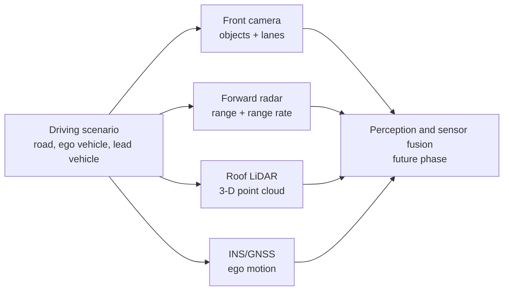
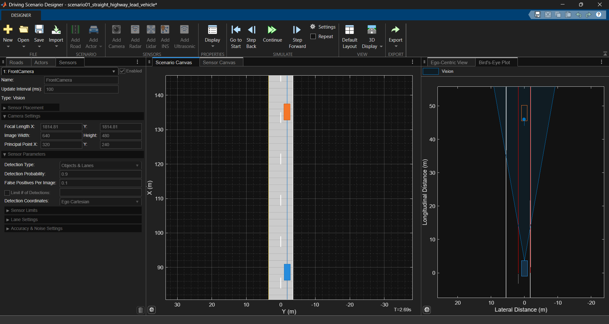
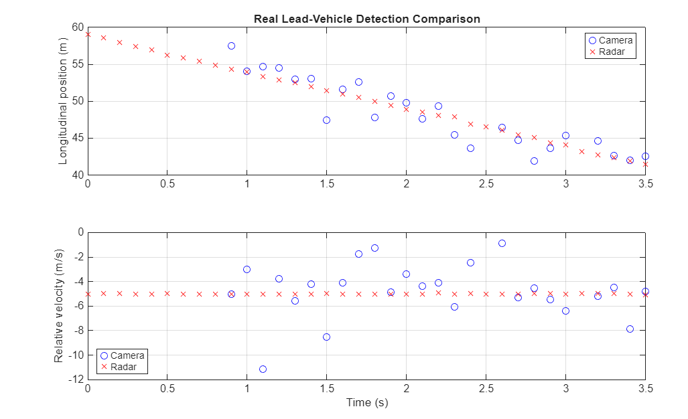
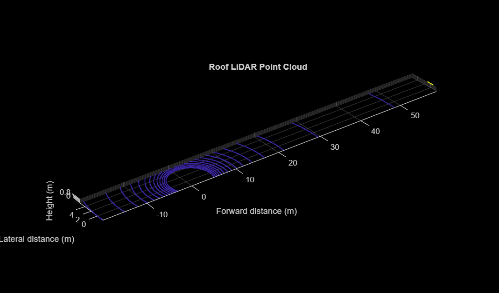
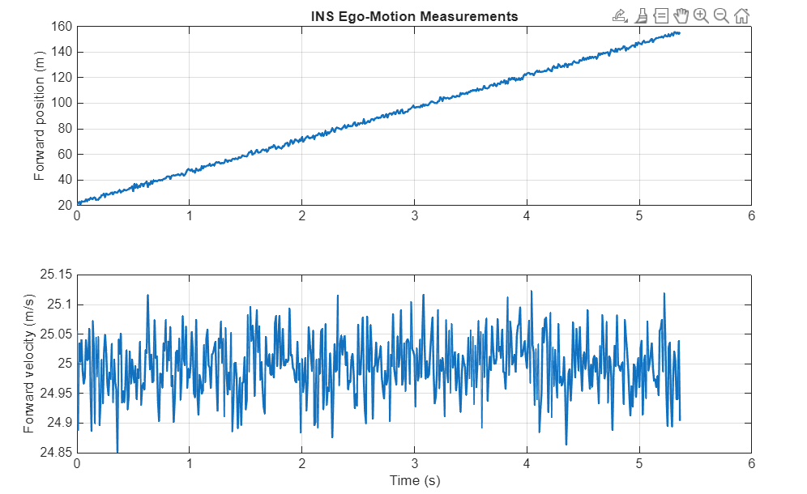

# Virtual Sensors in a Highway Driving Scenario

## Objective

This study adds four virtual sensors to the ego vehicle in the straight-highway lead-vehicle scenario. The goal is to understand what each sensor observes, how its data is represented in MATLAB, and why an ADAS system uses multiple sensor modalities.

## Scenario

The experiment uses the previously created straight, two-lane highway:

- Ego vehicle: 25 m/s
- Lead vehicle: 20 m/s in the same lane
- Initial separation: approximately 60 m
- Scenario: `scenario04_straight_highway_front_camera.mat`

The ego vehicle closes the gap at approximately 5 m/s. This makes the lead vehicle a useful common target for comparing sensor outputs.

## Sensor Suite



| Sensor | Mounting position on ego vehicle | Primary output | What it contributes |
| --- | --- | --- | --- |
| Front camera | Front centre, X = 3.7 m, height = 1.1 m | Object detections and lane boundaries | Lane geometry and visual object information |
| Forward radar | Front centre, X = 3.7 m, height = 0.2 m | Range and relative velocity | Reliable longitudinal distance and closing speed |
| Roof LiDAR | X = 0.95 m, height = 1.6 m | 3-D point cloud | Accurate spatial geometry and object shape |
| Ego INS/GNSS | X = 1.5 m, height = 1.0 m | Position, velocity, orientation, acceleration | Ego-motion estimate and global/local positioning |

All sensor positions use the ego-vehicle coordinate frame: X points forward, Y points left, and Z points upward.

## 1. Front Camera

The camera was configured to report **Objects & Lanes**. Its focal length was reduced to 554.26 pixels for a wider forward field of view. The simulated camera identifies the lead vehicle and estimates the left and right lane boundaries.



### Camera outputs

`ObjectDetections` contains `objectDetection` objects. In ego Cartesian coordinates, one object measurement has the structure:

```text
[x; y; z; vx; vy; vz]
```

For the lead vehicle, the values represent its relative forward position, lateral position, height, and relative velocity.

`LaneDetections` contains clothoid lane-boundary models. In the straight-road experiment, the estimated lane curvature was approximately zero. The detected left and right lateral offsets were close to `+1.86 m` and `-1.70 m`, giving a lane width close to the configured 3.6 m.

### Limitation observed

Camera position and velocity measurements showed visibly more variation than radar. This is expected: visual detections depend on image geometry, detection accuracy, and noise.

## 2. Forward Radar

The radar was configured to look straight ahead with a narrow 20 degree azimuth field of view, a 100 m maximum range, and range-rate reporting.

Radar detects the lead vehicle as an object measurement. Its key advantage in this scenario is the stable estimate of longitudinal range and relative velocity.

### Camera and radar comparison



The radar measurements remain close to the expected relative velocity of `-5 m/s` because the ego vehicle travels 5 m/s faster than the lead vehicle. Camera measurements are more dispersed, while radar range-rate measurements are more stable. This is a practical reason that production ADAS systems fuse camera and radar rather than relying on only one sensor.

> A `TargetIndex` less than zero in generated data identifies a simulated false alarm, not a real actor. Real detections in this scenario correspond to the lead vehicle.

## 3. Roof LiDAR

The roof LiDAR was configured with a 120 m maximum range, 360 degree azimuth coverage, and a vertical field of view from -20 to 20 degrees. It produces point-cloud returns rather than a single object detection.



### Reading the top-view point cloud

- Purple arcs are LiDAR scan returns from the road and lane environment.
- The distant return near 58 m is associated with the lead vehicle.
- The broad coverage behind the ego vehicle is expected because the LiDAR uses 360 degree azimuth coverage.

LiDAR provides useful geometry, but later perception steps must cluster and classify points before they become object tracks.

## 4. INS/GNSS

The INS reports ego motion rather than detecting external objects. GNSS fix was enabled, and measurement noise was retained to make the output realistic.

One exported INS measurement contained:

```text
Orientation:     [-0.0431  -0.1764  -0.6326] deg
Position:        [20.5497  -0.4687   0.8925] m
Velocity:        [25.0558   0.0515  -0.0130] m/s
Acceleration:    approximately [0 0 0] m/s^2
AngularVelocity: approximately [0 0 0]
```

The near-zero acceleration and angular velocity are correct for the constant-speed, straight-road segment. The forward velocity is approximately 25 m/s, which agrees with the ego-vehicle trajectory. Small fluctuations arise from the configured INS/GNSS measurement accuracy.



The forward position grows almost linearly, while forward velocity remains centred around 25 m/s. This validates the ego-motion output.

## Data Inspection Workflow

The designer exports sensor frames as a structure array. Each frame can include `ObjectDetections`, `LaneDetections`, `PointClouds`, and `INSMeasurements`.

Always identify object-detection origin using `SensorIndex`; do not assume that an entry in the exported array belongs to a particular sensor.

```matlab
for k = 1:numel(allSensorData)
    detections = allSensorData(k).ObjectDetections;

    for n = 1:numel(detections)
        detection = detections{n};
        fprintf('Sensor %d, target %d\n', ...
            detection.SensorIndex, ...
            detection.ObjectAttributes{1}.TargetIndex);
    end
end
```

## Key Takeaways

1. A camera detects lane boundaries and objects, but its object measurements can be noisy.
2. Radar measures longitudinal range and relative velocity reliably, including in conditions where vision can degrade.
3. LiDAR represents the environment as 3-D points and needs additional processing to form objects.
4. INS/GNSS estimates the ego vehicle's own motion; it is essential for localization and for interpreting all other sensor measurements.
5. No single sensor is sufficient. Camera, radar, LiDAR, and INS form complementary inputs for perception and sensor fusion.

## Next Step

Use these sensor outputs in the perception phase: first study lane detection from the camera, then vehicle detection and multi-sensor tracking.
