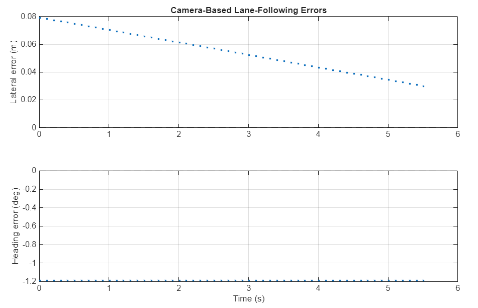
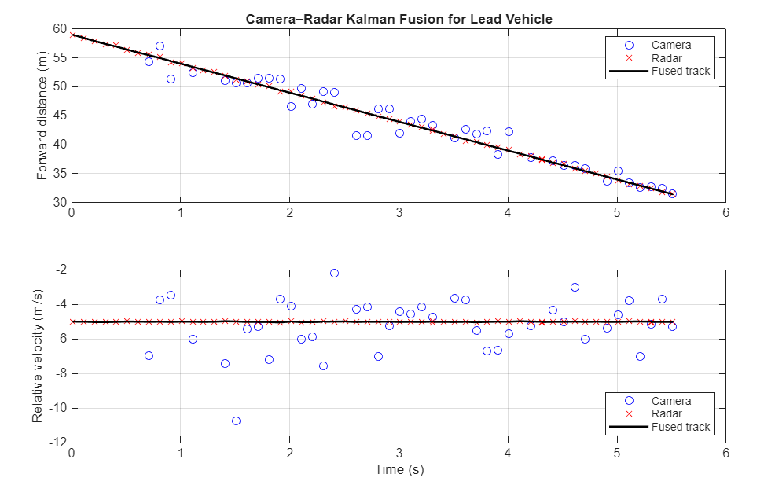
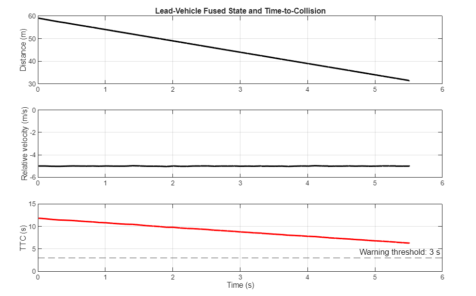
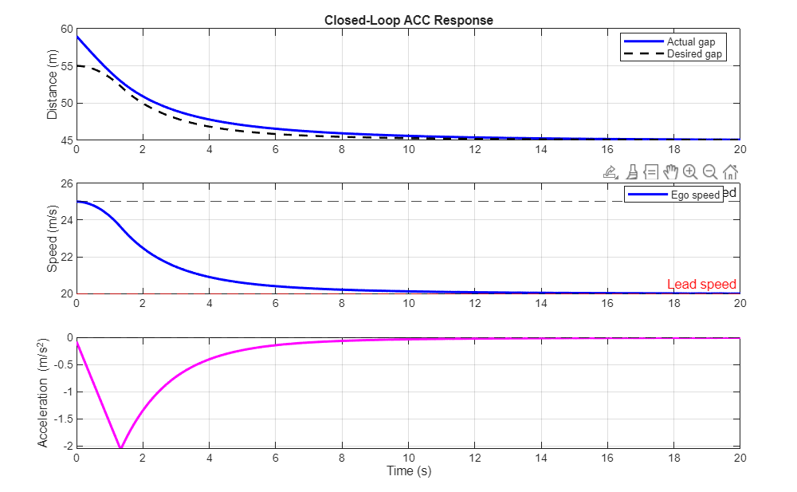
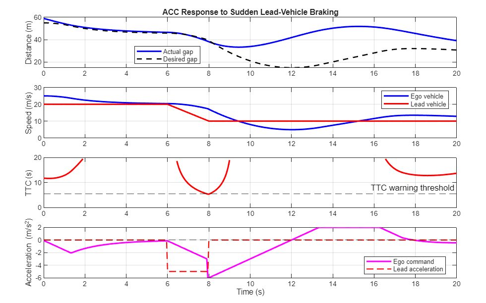

# Perception to Adaptive Cruise Control Prototype

## Purpose

This session connected virtual-sensor outputs to a small, reproducible longitudinal-driving prototype. The workflow starts with camera lane perception, estimates a lead vehicle with camera and radar, assesses collision risk, and produces an Adaptive Cruise Control (ACC) response.

The scripts use data exported from the straight-highway scenario in Driving Scenario Designer. They are learning prototypes, not a production-ready ADAS controller.

## System Flow

```text
Front camera ──> lane boundaries ──> lane centre and lane errors

Front camera ──┐
               ├──> Kalman fusion ──> lead range and relative velocity
Forward radar ─┘                              │
                                               ▼
                                      Time gap and TTC
                                               │
                                               ▼
                                   Follow / brake decision
                                               │
                                               ▼
                                Closed-loop ACC simulation
```

## 1. Lane Perception and Lane-Centre Estimation

The forward camera supplies two `clothoidLaneBoundary` models. Their lateral offsets are measured in the ego-vehicle coordinate frame:

- Positive lateral offset: left of the ego vehicle
- Negative lateral offset: right of the ego vehicle

The detected lane centre at the ego reference point is the average of the left and right boundary offsets:

```text
laneCentreOffset = (leftBoundaryOffset + rightBoundaryOffset) / 2
```

For the straight-highway data, the measured boundaries were approximately `+1.863 m` and `-1.705 m`, giving a lane-centre offset of `+0.079 m`. This means the ego vehicle was estimated to be about 7.9 cm right of the detected lane centre. The average boundary heading gave a small heading error of about `-1.19 degrees`.



Run: [`lane_center_estimation.m`](../../matlab/04_lane_detection/lane_center_estimation.m)

## 2. Camera-Radar Lead-Vehicle Fusion

The camera and radar both detect the lead vehicle. The radar measurements are more reliable for longitudinal range and relative velocity; the camera is noisier but supplies complementary visual evidence.

The Kalman filter state is:

```text
x = [forward range; relative velocity]
```

The state is predicted using a constant-relative-velocity model:

```text
range(k+1) = range(k) + relativeVelocity(k) * dt
relativeVelocity(k+1) = relativeVelocity(k)
```

Each camera or radar event then updates the predicted state. The radar measurement-noise covariance is deliberately lower, so the fused estimate follows radar closely without chasing camera velocity outliers.



Run: [`camera_radar_lead_vehicle_fusion.m`](../../matlab/05_sensor_fusion/camera_radar_lead_vehicle_fusion.m)

> `TargetIndex = 2` is used only to identify the known simulated lead vehicle. A real vehicle must associate detections to tracks without access to this ground-truth ID.

## 3. Time Gap, TTC, and Longitudinal Decision

Two measures guide longitudinal behavior:

```text
timeGap = forwardRange / egoSpeed
TTC = -forwardRange / relativeVelocity    (only when relativeVelocity < 0)
```

`relativeVelocity < 0` means the ego vehicle is closing on the lead vehicle. The decision prototype applies these rules:

| Condition | Decision |
|---|---|
| TTC below warning threshold | Brake |
| Time gap below 2 s | Follow lead vehicle |
| Otherwise | Maintain set speed |

In the exported scenario, the time gap falls below 2 s around 1.8 s. TTC remains comfortably above the 3 s warning threshold, so the correct initial behavior is to follow rather than emergency brake.



Run after the fusion script: [`lead_vehicle_ttc_decision.m`](../../matlab/06_control/lead_vehicle_ttc_decision.m)

## 4. Closed-Loop ACC

The first controller uses a spacing error and relative-velocity error to calculate acceleration:

```text
desiredDistance = minimumGap + desiredTimeGap * egoSpeed
distanceError = actualGap - desiredDistance
accelerationTarget = Kp * distanceError + Kv * relativeVelocity
```

Normal operation is constrained to comfortable acceleration limits and a jerk limit. The jerk limit prevents abrupt changes in acceleration.

In the normal-following test, the ego vehicle decelerates from 25 m/s to the lead-vehicle speed of 20 m/s. The resulting target gap is:

```text
5 m + (2 s * 20 m/s) = 45 m
```



## 5. Sudden Lead-Vehicle Braking Test

The stress test makes the lead vehicle brake from 20 m/s to 10 m/s between 6 s and 8 s. A deliberate TTC threshold of 5.5 s activates the emergency-braking path, which commands `-6 m/s^2`.



The test exposes an expected limitation of the simple controller: after emergency braking, it can over-correct and then accelerate too strongly. This motivates the next step.

## Key Takeaways

- Camera lane boundaries provide lateral and heading information for lane following.
- Radar provides accurate lead-vehicle range and relative velocity; camera measurements are useful but noisier.
- Kalman fusion produces a stable target state for downstream decisions.
- Time gap supports comfortable following; TTC supports safety intervention.
- A closed-loop controller must account for actuator limits and safety modes.
- A production ACC design needs a state machine and hysteresis to recover smoothly after emergency braking.

## Next Step

Implement three explicit ACC modes:

```text
Cruise -> Follow -> Emergency Brake
```

The mode transitions should use thresholds with hysteresis, preventing rapid switching and improving recovery after a safety event.
