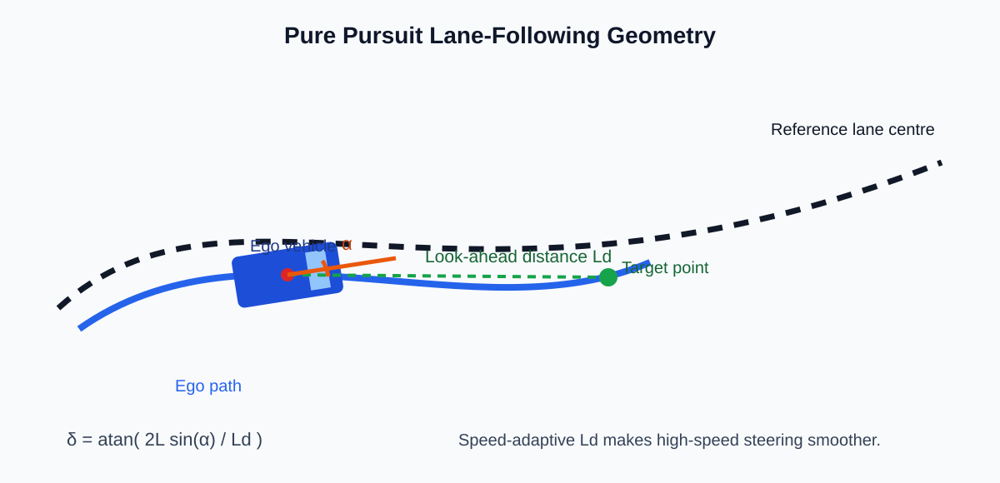

# Lane-Following Reference and Pure Pursuit Planning

## Reference Lane Centre

Lane following converts detected lane boundaries into a lane-centre reference. For a left and right boundary, the centre estimate is:

$$
y_{centre}(x)=\frac{y_{left}(x)+y_{right}(x)}{2}
$$

The Pure Pursuit exercises use a smooth synthetic centreline so controller behaviour can be studied independently of camera noise.

## Target-Point Selection

Pure Pursuit finds the nearest reference point, then selects a target approximately one look-ahead distance ahead. The target creates the angle $\alpha$ relative to the ego heading.

~~~mermaid
flowchart LR
    L[Lane boundaries or reference path] --> C[Lane-centre path]
    P[Ego position and heading] --> N[Nearest path point]
    C --> N
    N --> T[Look-ahead target]
    T --> A[Target angle alpha]
    A --> S[Pure Pursuit steering request]
~~~

## Steering Law

$$
\delta=\tan^{-1}\left(\frac{2L\sin\alpha}{L_d}\right)
$$

| Symbol | Meaning |
|---|---|
| $L$ | Vehicle wheelbase |
| $L_d$ | Look-ahead distance |
| $\alpha$ | Ego-heading-to-target angle |
| $\delta$ | Road-wheel steering request |

## Look-Ahead Trade-Off

| Look-ahead distance | Behaviour |
|---|---|
| Short | Fast correction, but more steering activity and oscillation risk |
| Long | Smooth steering, but slower response to errors and tight curves |
| Speed-adaptive | Short at low speed and farther ahead at high speed |

The speed-adaptive strategy is:

$$
L_d=\operatorname{clip}(L_{d,min}+K_vv,L_{d,min},L_{d,max})
$$

See [pure_pursuit_lane_following.m](../../matlab/06_control/pure_pursuit_lane_following.m), [pure_pursuit_with_steering_limits.m](../../matlab/06_control/pure_pursuit_with_steering_limits.m), and [adaptive_pure_pursuit_lane_following.m](../../matlab/06_control/adaptive_pure_pursuit_lane_following.m).

## Steering Actuator Limits

A controller request is not always physically achievable. The experiments apply steering angle and rate limits:

$$
\delta_{limited}=\operatorname{clip}(\delta_{req},-\delta_{max},\delta_{max})
$$

$$
\delta_{k+1}=\delta_k+\operatorname{clip}(\delta_{limited}-\delta_k,-\dot{\delta}_{max}T_s,\dot{\delta}_{max}T_s)
$$

This turns an ideal steering request into a feasible vehicle command and prepares the lateral controller for the integrated LKA + ACC model.
