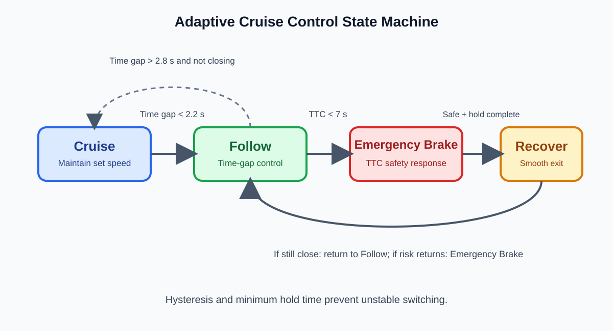

# Adaptive Cruise Control (ACC)

## Purpose

Adaptive Cruise Control regulates the ego vehicle's longitudinal speed. It keeps the selected cruise speed when the road ahead is clear, but reduces speed when a lead vehicle makes the available gap unsafe.

This chapter documents [acc_state_machine.m](../../matlab/06_control/acc_state_machine.m) and [closed_loop_acc_emergency_braking.m](../../matlab/06_control/closed_loop_acc_emergency_braking.m).

> This is an educational simulation. A production ACC feature needs validated sensing, a certified vehicle model, fault handling, and a safety process.

## Signals Used by ACC

| Signal | Meaning | Unit |
|---|---|---|
| `gap` | Distance from ego vehicle to lead vehicle | m |
| `egoSpeed` | Ego longitudinal speed | m/s |
| `leadSpeed` | Lead-vehicle longitudinal speed | m/s |
| `relativeVelocity` | `leadSpeed - egoSpeed` | m/s |
| `timeGap` | Available following time | s |
| `TTC` | Time until collision at the current closing speed | s |

The camera-radar perception prototype supplies the lead-vehicle range and relative velocity. See [Perception to ACC Prototype](../05_perception/Perception_to_ACC_Prototype.md).

## Safety Metrics

### Desired following distance

$$
d_{desired}=d_0+T_{desired}v_{ego}
$$

Here $d_0=5$ m is the standstill distance and $T_{desired}=2$ s is the desired time gap. At 25 m/s, the desired gap is 55 m.

### Time gap and time to collision

$$
T_{gap}=\frac{d}{\max(v_{ego},\epsilon)}
$$

$$
TTC=\begin{cases}
-\frac{d}{v_{rel}}, & v_{rel}<0\\
\infty, & v_{rel}\geq0
\end{cases}
$$

Time gap supports normal car following. TTC is evaluated only while the ego vehicle is closing on the lead vehicle.

## ACC Finite-State Machine

~~~mermaid
stateDiagram-v2
    [*] --> Cruise
    Cruise --> Follow: time gap < 2.2 s
    Follow --> Cruise: time gap > 2.8 s and lead is not closing
    Follow --> EmergencyBrake: TTC < 7 s
    EmergencyBrake --> Recover: hold time complete and safety recovered
    Recover --> EmergencyBrake: TTC < 7 s
    Recover --> Follow: time gap < 2.2 s
    Recover --> Cruise: time gap > 2.8 s and lead is not closing
~~~

| State | Intent | Command behaviour |
|---|---|---|
| Cruise | Maintain selected speed | Speed-error controller |
| Follow | Keep a safe gap | Gap and relative-velocity feedback |
| Emergency Brake | Respond to collision risk | Strong fixed braking |
| Recover | Return smoothly after braking | Gentler gap and velocity feedback |

Separate state-entry and state-exit thresholds provide **hysteresis**, so the controller does not keep switching at one noisy boundary. Emergency Brake also has a minimum hold time.

## Controller and Actuator

The gap error is:

$$
e_d=d-d_{desired}
$$

Follow mode uses:

$$
a_{req}=K_d e_d+K_vv_{rel}
$$

Cruise uses:

$$
a_{req}=K_c(v_{set}-v_{ego})
$$

Normal commands are limited to $-3\leq a_{req}\leq2$ m/s$^2$. Emergency Brake overrides the comfort braking limit with -6 m/s$^2$.

Normal commands are jerk limited:

$$
\Delta a_{max}=j_{max}T_s
$$

$$
a_{k+1}=a_k+\operatorname{clip}(a_{req}-a_k,-\Delta a_{max},\Delta a_{max})
$$

The implementation uses $j_{max}=3$ m/s$^3$.

## Closed-Loop Update

$$
v_{ego,k+1}=\max(0,v_{ego,k}+a_{ego,k}T_s)
$$

$$
d_{k+1}=\max(0,d_k+(v_{lead,k}-v_{ego,k})T_s)
$$

~~~mermaid
flowchart LR
    S[Camera + radar lead state] --> M[Gap, time gap and TTC]
    M --> FSM[ACC state machine]
    FSM --> C[Acceleration command]
    C --> A[Limits and jerk-limited actuator]
    A --> V[Ego speed and gap dynamics]
    V --> M
~~~

## Sudden-Braking Exercise

The lead vehicle begins at 20 m/s and brakes at -5 m/s$^2$ from 6 s to 8 s. The ego vehicle begins at 25 m/s with a 59 m gap. The expected sequence is Follow, Emergency Brake once TTC becomes unsafe, then Recover after a safe condition and the minimum hold time.

## Key Takeaways

- Time gap supports comfortable following; TTC detects urgent closing risk.
- ACC is closed loop: acceleration changes the next gap measurement.
- State machines, hysteresis, saturation, and jerk limits make the controller more realistic.
