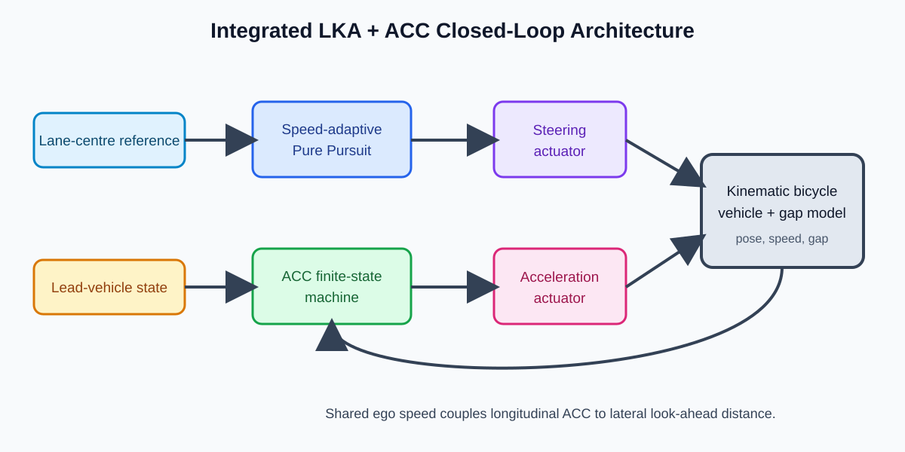

# Integrated Lane Keeping Assist and Adaptive Cruise Control

## Purpose

This exercise combines lateral Lane Keeping Assist (LKA) and longitudinal Adaptive Cruise Control (ACC) in one ego-vehicle simulation. The implementation is [integrated_lka_acc_simulation.m](../../matlab/06_control/integrated_lka_acc_simulation.m).

There is one ego vehicle: Pure Pursuit determines steering, ACC determines acceleration, and both commands update the same state.

~~~mermaid
flowchart LR
    Lane[Lane-centre reference] --> PP[Speed-adaptive Pure Pursuit]
    Lead[Fused lead-vehicle state] --> ACC[ACC finite-state machine]
    Ego[Ego speed] --> PP
    Ego --> ACC
    PP --> Steering[Steering actuator]
    ACC --> Acceleration[Acceleration actuator]
    Steering --> Vehicle[Kinematic bicycle vehicle]
    Acceleration --> Vehicle
    Vehicle --> Ego
    Vehicle --> Pose[Ego pose]
    Pose --> PP
~~~

## Shared Vehicle State

$$
\mathbf{x}=[x,y,\psi,v_{ego},d]^T
$$

The pose $x,y,\psi$, ego speed $v_{ego}$, and lead-vehicle gap $d$ evolve together. ACC braking lowers speed, so Pure Pursuit automatically uses a shorter look-ahead distance.

## Lateral Control

The lane-centre reference is:

$$
y_{ref}(x)=3\sin(0.035x)
$$

The adaptive look-ahead rule is:

$$
L_d=\operatorname{clip}(L_{d,min}+K_vv_{ego},L_{d,min},L_{d,max})
$$

with $L_{d,min}=5$ m, $L_{d,max}=20$ m, and $K_v=0.6$ s.

Pure Pursuit requests:

$$
\delta_{req}=\tan^{-1}\left(\frac{2L\sin\alpha}{L_d}\right)
$$

where $L=2.8$ m and $\alpha$ is the target angle. The steering actuator is limited to ±12 degrees and ±30 degrees/s.

## Longitudinal Control

ACC receives lead-vehicle gap and relative velocity. Its desired spacing is:

$$
d_{desired}=5+2v_{ego}
$$

It applies Cruise, Follow, Emergency Brake, and Recover logic. See [Adaptive Cruise Control](Adaptive_Cruise_Control.md) for the detailed state machine.

## Vehicle Model

$$
\dot{x}=v_{ego}\cos\psi
$$

$$
\dot{y}=v_{ego}\sin\psi
$$

$$
\dot{\psi}=\frac{v_{ego}}{L}\tan\delta
$$

$$
v_{ego,k+1}=\max(0,v_{ego,k}+a_{ego,k}T_s)
$$

$$
d_{k+1}=\max(0,d_k+(v_{lead,k}-v_{ego,k})T_s)
$$

## Interpreting the Run

The simulation starts 1.5 m off centre with a 5 degree heading error. Pure Pursuit removes these errors while the ACC reduces ego speed for the slower, braking lead vehicle. The look-ahead distance decreases from its 20 m maximum to about 11–12 m as speed falls.

Small jagged values in the tracking-error plot are caused by selecting the nearest sample in a path spaced at 0.2 m. They are a reference-sampling artefact rather than necessarily a lateral-control instability.

## Limitations and Next Improvement

- The lane centre is a known mathematical path, not a live camera estimate.
- The lead vehicle is a one-dimensional gap model.
- The bicycle model omits tire slip, roll, and powertrain dynamics.

Next, calculate signed cross-track error from a smooth path projection and report RMS and maximum tracking errors.
