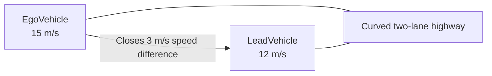

# Driving Scenarios

Reusable Automated Driving Toolbox scenarios for developing and validating ADAS functions. Each scenario has a visual Driving Scenario Designer project (`.mat`) and a reproducible MATLAB representation (`.m`).

## Scenario Catalogue

| Scenario | Road geometry | Traffic condition | Primary learning objective |
| --- | --- | --- | --- |
| [Scenario 01](#scenario-01--straight-highway-lead-vehicle) | Straight, two-lane highway | Slower lead vehicle in ego lane | Relative motion and repeatable traffic setup |
| [Scenario 02](#scenario-02--curved-highway-lead-vehicle) | Curved, two-lane highway | Slower lead vehicle in ego lane | Curved road geometry and lane-following context |

## Scenario 01 — Straight Highway Lead Vehicle


### Objective

Create a simple, repeatable lead-vehicle scenario without sensors or ADAS control logic.

| Parameter | Value |
| --- | --- |
| Road | 250 m straight, two lanes |
| Ego vehicle | `EgoVehicle`, 25 m/s (90 km/h) |
| Lead vehicle | `LeadVehicle`, 20 m/s (72 km/h) |
| Initial gap | 60 m |
| Closing speed | 5 m/s |

[Open the MATLAB function](scenario01_straight_highway_lead_vehicle.m) · `scenario01_straight_highway_lead_vehicle.mat`

## Scenario 02 — Curved Highway Lead Vehicle


### Objective

Create a curved-road following scenario that introduces changing road geometry while retaining a clear ego/lead-vehicle interaction.



| Parameter | Value |
| --- | --- |
| Road | Two-lane curved highway defined by three centre points |
| Ego vehicle | `EgoVehicle`, 15 m/s (54 km/h) |
| Lead vehicle | `LeadVehicle`, 12 m/s (43.2 km/h) |
| Vehicle relation | Same lane; lead vehicle starts ahead of ego vehicle |
| Scenario purpose | Study curved-road traffic motion before adding sensors or controllers |

### Engineering Notes

- Road centre points define the road geometry; vehicle trajectory waypoints independently define how each actor moves through that geometry.
- The ego trajectory uses six waypoints to stay aligned with the curve; the lead vehicle uses four waypoints over the remaining route.
- The lower speeds are appropriate for this tighter curve and make the movement easier to inspect visually.
- This is an open-loop scenario: the ego vehicle does not yet adapt its speed in response to the lead vehicle.

[Open the MATLAB function](scenario02_curved_highway_lead_vehicle.m) · `scenario02_curved_highway_lead_vehicle.mat`

## Run a Scenario

```matlab
[scenario, egoVehicle] = scenario02_curved_highway_lead_vehicle;
plot(scenario)
```

Open a `.mat` file in Driving Scenario Designer for visual editing. Use the corresponding `.m` function for version-controlled changes, scripted scenario creation, and later scenario variations.

## Next Scenario

Create an intersection scenario with crossing actors. This introduces interaction geometry beyond same-lane longitudinal following.