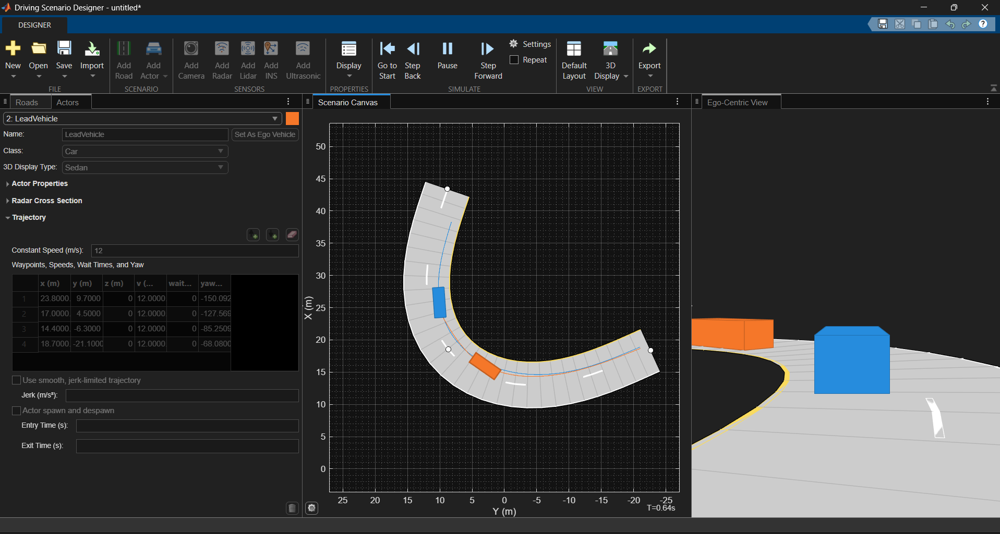
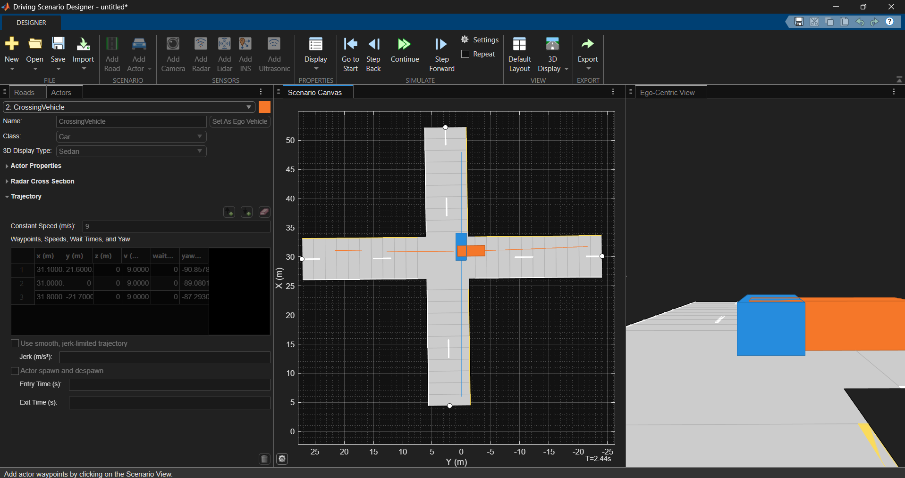
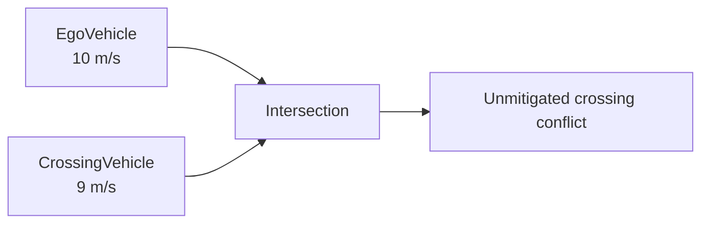

# Driving Scenarios

Reusable Automated Driving Toolbox scenarios for developing and validating ADAS functions. Each scenario includes a visual Driving Scenario Designer project (`.mat`) and a reproducible MATLAB representation (`.m`).

## Scenario Catalogue

| Scenario | Road geometry | Traffic condition | Primary learning objective |
| --- | --- | --- | --- |
| [Scenario 01](#scenario-01--straight-highway-lead-vehicle) | Straight, two-lane highway | Slower lead vehicle in ego lane | Relative motion and repeatable traffic setup |
| [Scenario 02](#scenario-02--curved-highway-lead-vehicle) | Curved, two-lane highway | Slower lead vehicle in ego lane | Curved road geometry and lane-following context |
| [Scenario 03](#scenario-03--intersection-crossing-vehicle) | Two-road intersection | Timed crossing vehicle | Cross-traffic conflict and timing |

## Scenario 01 — Straight Highway Lead Vehicle


| Parameter | Value |
| --- | --- |
| Road | 250 m straight, two lanes |
| Ego vehicle | `EgoVehicle`, 25 m/s (90 km/h) |
| Lead vehicle | `LeadVehicle`, 20 m/s (72 km/h) |
| Initial gap | 60 m |
| Closing speed | 5 m/s |

[Open the MATLAB function](scenario01_straight_highway_lead_vehicle.m) · `scenario01_straight_highway_lead_vehicle.mat`

## Scenario 02 — Curved Highway Lead Vehicle



| Parameter | Value |
| --- | --- |
| Road | Two-lane curved highway defined by three centre points |
| Ego vehicle | `EgoVehicle`, 15 m/s (54 km/h) |
| Lead vehicle | `LeadVehicle`, 12 m/s (43.2 km/h) |
| Vehicle relation | Same lane; lead vehicle starts ahead of ego vehicle |
| Scenario purpose | Curved-road traffic motion before sensors or controllers |

[Open the MATLAB function](scenario02_curved_highway_lead_vehicle.m) · `scenario02_curved_highway_lead_vehicle.mat`

## Scenario 03 — Intersection Crossing Vehicle



### Objective

Create a repeatable cross-traffic conflict at a two-road intersection. This scenario is the foundation for future object detection, collision warning, braking, and intersection-decision studies.



| Parameter | Value |
| --- | --- |
| Main road | `MainRoad`, two lanes |
| Crossing road | `CrossRoad`, two lanes |
| Ego vehicle path | `(6, 0)` m to `(48, 0)` m at 10 m/s |
| Crossing vehicle path | `(31.1, 21.6)` m to `(31.8, -21.7)` m at 9 m/s |
| Conflict timing | Both vehicles enter the intersection at approximately 2.4 s |
| Scenario result | Vehicle paths overlap without ADAS intervention |

### Engineering Notes

- The traffic conflict is deliberate; no collision avoidance is implemented at this stage.
- Scenario 03 separates road geometry from actor trajectories: each actor must be given its own motion path.
- The coordinate and speed choices make the conflict deterministic and appropriate for regression testing later.
- A perception-and-control stack should ultimately detect this condition and issue a warning, brake, or avoid the collision.

[Open the MATLAB function](scenario03_intersection_crossing_vehicle.m) · `scenario03_intersection_crossing_vehicle.mat`

## Run a Scenario

```matlab
[scenario, egoVehicle] = scenario03_intersection_crossing_vehicle;
plot(scenario)
```

Open a `.mat` file in Driving Scenario Designer for visual editing. Use the corresponding `.m` function for version-controlled changes, scripted scenario creation, and scenario variations.

## Next Topic

Begin virtual sensor simulation: mount a forward-facing camera on the ego vehicle, define its field of view, and inspect synthetic detections.