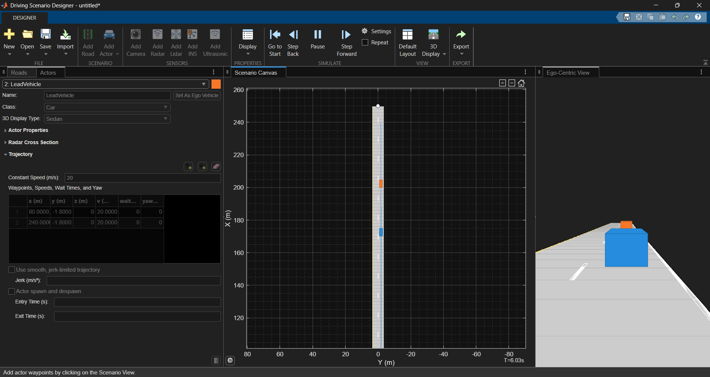
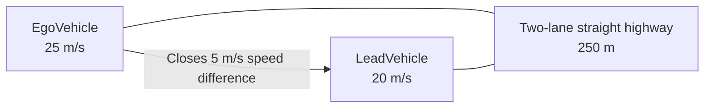

# Driving Scenarios

This folder contains reusable Automated Driving Toolbox scenarios used to develop and validate ADAS functions.

## Scenario 01 — Straight Highway Lead Vehicle

A two-lane, straight-highway scenario with an ego vehicle approaching a slower lead vehicle in the same lane. It is the first reusable test case for future lane-following, adaptive-cruise-control, perception, and sensor-fusion work.



## Objective

Create a simple, repeatable traffic situation that demonstrates relative motion between an ego vehicle and a lead vehicle without introducing sensors or ADAS control logic.

## Scenario Topology



## Configuration

| Element | Configuration |
| --- | --- |
| Road name | `StraightHighway` |
| Road geometry | Straight, 250 m along the X-axis |
| Lane layout | Two lanes, nominally 3.6 m each |
| Ego vehicle | `EgoVehicle` |
| Ego trajectory | `(20, -1.8, 0)` m to `(240, -1.8, 0)` m |
| Ego speed | 25 m/s (90 km/h) |
| Lead vehicle | `LeadVehicle` |
| Lead trajectory | `(80, -1.8, 0)` m to `(240, -1.8, 0)` m |
| Lead speed | 20 m/s (72 km/h) |
| Initial longitudinal gap | 60 m |
| Closing speed | 5 m/s |
| Scenario sample time | 0.01 s |

## Expected Behaviour

Both vehicles follow the same lane in the positive X direction. Because the ego vehicle is faster, the separation decreases over time.

For example, at approximately 6 seconds:

```text
Ego position  ˜ 170 m
Lead position ˜ 200 m
Gap           ˜ 30 m
```

This behaviour is intentional. The scenario is open loop: it contains traffic motion only, so the ego vehicle does not brake or respond automatically.

## Files

| File | Purpose |
| --- | --- |
| [scenario01_straight_highway_lead_vehicle.m](scenario01_straight_highway_lead_vehicle.m) | MATLAB function that reconstructs the scenario |
| `scenario01_straight_highway_lead_vehicle.mat` | Driving Scenario Designer project file |

## Run the Scenario

```matlab
[scenario, egoVehicle] = scenario01_straight_highway_lead_vehicle;
plot(scenario)
```

Use the Driving Scenario Designer app to edit the `.mat` project visually, or modify the `.m` function to create controlled scenario variations.

## Engineering Notes

- The first actor is the ego vehicle and is returned directly by the MATLAB function.
- The two vehicles share the same lateral coordinate (`y = -1.8 m`), placing them in the same lane.
- Exact coordinates and speeds make the scenario reproducible and suitable for automated tests.
- This scenario will later be extended with virtual sensors and controller logic; those capabilities are deliberately not included yet.

## Next Scenario

Create a curved-highway scenario to introduce road curvature before progressing to intersections and sensor simulation.